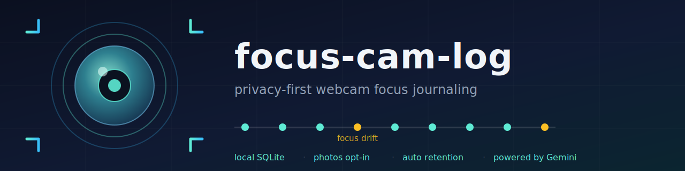

<p align="center">
  
</p>

A privacy-conscious, local-first webcam focus journaling tool. Analysis runs
on Google Gemini (default) or a fully local model via Ollama.

[日本語 README はこちら](README.ja.md)

focus-cam-log periodically captures a snapshot from your webcam, asks a vision
model what you are doing ("focused at the computer", "looking at the phone",
"away from desk", …), and records the result in a local SQLite database. It can
send optional focus-drift reminders as desktop notifications, and generate an
AI-written daily summary of your focus habits.

## Features

- **Periodic activity logging** — one webcam snapshot every N minutes,
  classified by a vision model into a short activity label.
- **Two analysis providers** — Google Gemini (default), or a local vision
  model via [Ollama](https://ollama.com) (`--provider ollama`) so that
  **images never leave your machine**.
- **Focus-drift reminders** (`--watch`) — an alert when the label suggests
  your attention has drifted (phone, sleeping, gaming, …). Choose how loud:
  a notification-center banner (default) or a dialog that stays on screen
  until dismissed (`FOCUS_LOG_ALERT_STYLE=dialog`).
- **Daily summary** (`--summary`) — Gemini writes a Markdown report of your
  focus time, breaks, and efficiency from the day's events.
- **Obsidian export** (`--obsidian`) — appends a Markdown table view of the
  day's log to your vault.
- **Privacy by design** — by default only the text activity log is kept;
  saving snapshots to disk is explicit opt-in (`--save-photos`), saved photos
  are automatically purged after a retention period (default: 3 days), and
  the database records when each photo was deleted. Only the snapshot being
  analyzed is sent to the Gemini API. See [PRIVACY.md](PRIVACY.md).

## Requirements

- Python 3.9+
- A webcam
- One of:
  - a Gemini API key ([Google AI Studio](https://aistudio.google.com/apikey)), or
  - [Ollama](https://ollama.com) with a vision-capable model
    (e.g. `ollama pull qwen3-vl:4b`)
- Desktop notifications: macOS (`osascript`) or Linux (`notify-send`);
  other platforms fall back to console output.

## Quick start

```bash
git clone <this-repo> focus-cam-log && cd focus-cam-log
./setup.sh
export GEMINI_API_KEY=your-key-here
./focus_on.sh          # start logging in the background (reminders on)
./focus_off.sh         # stop logging
```

`focus_on.sh` starts the monitor with `nohup`, so it keeps running even after
you close the terminal window or quit the terminal app — it only stops when
you run `focus_off.sh` or reboot. Run `focus_off.sh` when you're done, or it
will keep capturing indefinitely.

Or fully local with Ollama — no API key, images never leave your machine:

```bash
ollama pull qwen3-vl:4b
./focus_on.sh --provider ollama
```

Or run in the foreground:

```bash
source venv/bin/activate
python3 focus_monitor.py --interval 10 --watch
python3 focus_monitor.py --provider ollama --watch   # local analysis
```

Generate today's summary:

```bash
python3 focus_monitor.py --summary            # today
python3 focus_monitor.py --summary --summary-date 2026-07-01
```

Watch what's being detected live, in a separate terminal window:

```bash
./focus_watch.sh   # tails the log, filtered to activity/mode lines only
```

This is read-only — it just follows the log file and never affects the
running monitor. Close the window or hit Ctrl+C any time.

## Persistent local-only setup

If you want focus-cam-log to **always** run in local-only mode — surviving
restarts, with no `--provider ollama` needed each run — put the settings in
the env file (loaded at startup; config priority is
CLI args > process env > env file > defaults):

```bash
mkdir -p ~/.focus-log
cat > ~/.focus-log/env <<'ENV'
FOCUS_LOG_PROVIDER=ollama
FOCUS_LOG_VISION_MODEL=qwen3-vl:4b
FOCUS_LOG_SUMMARY_MODEL=qwen3-vl:4b
ENV

./focus_on.sh
```

With this config, `./focus_on.sh` starts in Ollama local-only mode without
passing `--provider ollama` each time. The startup banner always shows which
mode is active (`Mode: local-only` vs `Mode: cloud`) — if you ever see
`Mode: cloud` unexpectedly, your env file is not being read.

`FOCUS_LOG_SUMMARY_MODEL` may point at any Ollama text model if you prefer a
different one for daily summaries (vision capability is only needed for
`FOCUS_LOG_VISION_MODEL`).

## Stronger focus-drift alerts

The default `--watch` alert is a macOS notification-center banner — easy to
miss, especially since a drifted-attention moment is exactly when you're not
looking at the screen. `FOCUS_LOG_ALERT_STYLE=dialog` uses a native
`display dialog` instead: it stays on screen until you click OK. No fullscreen
overlay, no extra GUI dependency — just a stronger version of the same native
macOS alert.

```bash
# ~/.focus-log/env
FOCUS_LOG_ALERT_STYLE=dialog
FOCUS_LOG_ALERT_COOLDOWN_MINUTES=20   # don't stack a dialog every single cycle
```

`FOCUS_LOG_ALERT_STYLE=off` disables focus-drift alerts entirely (the daily
summary and log are unaffected either way).

### Reference setup (what the author actually runs)

This tool is dogfooded daily in local-only mode on an Apple Silicon Mac mini
(M4, 32 GB), with focus-drift reminders and the Obsidian export on:

```bash
# ~/.focus-log/env
FOCUS_LOG_PROVIDER=ollama
FOCUS_LOG_VISION_MODEL=qwen3-vl:4b        # ~15 s per frame — plenty for 10-min intervals
FOCUS_LOG_SUMMARY_MODEL=gemma4:12b-it-qat # daily summaries (any local text model works)
```

```bash
./focus_on.sh   # 10-min interval, --watch reminders, fully local
```

Notes from real use:

- In a side-by-side test against the cloud provider, `qwen3-vl:4b` produced
  equivalent activity labels on ordinary frames; the 8B variant was not worth
  twice the memory.
- Daily summaries from the Gemma 12B QAT build were subjectively the best of
  the three models compared — including the cloud default.
- On a 32 GB machine, stick to **one** vision model. Alternating between
  several local models causes model-reload thrashing (measured: ~15 s per
  frame degrading to 60–94 s).

## Options

| Flag | Description | Default |
| --- | --- | --- |
| `--provider {gemini,ollama}` | analysis backend (cloud or local) | `gemini` |
| `--interval N` | capture interval in minutes | `10` |
| `--watch` | send focus-drift reminders | off |
| `--save-photos` | keep snapshots on disk (default is text log only) | off |
| `--retention-days N` | days to keep saved photos before purging | `3` |
| `--obsidian` | export a daily Markdown view (needs `FOCUS_LOG_OBSIDIAN_DIR`) | off |
| `--lang {ja,en}` | language for analysis labels and notifications | `ja` |
| `--summary` | generate a daily summary and exit | — |
| `--summary-date YYYY-MM-DD` | target date for `--summary` | today |

## Configuration (environment variables)

| Variable | Description | Default |
| --- | --- | --- |
| `FOCUS_LOG_PROVIDER` | analysis backend: `gemini` or `ollama` | `gemini` |
| `GEMINI_API_KEY` | Gemini API key (required for the gemini provider) | — |
| `FOCUS_LOG_DATA_DIR` | data directory (DB, photos, summaries) | `~/.focus-log` |
| `FOCUS_LOG_ENV_FILE` | env file: any `FOCUS_LOG_*` variable and `GEMINI_API_KEY` are loaded from it | `$FOCUS_LOG_DATA_DIR/env` |
| `FOCUS_LOG_OBSIDIAN_DIR` | Obsidian vault path for `--obsidian` export | unset |
| `FOCUS_LOG_MODEL` | model name (both vision and summary) | `gemini-2.5-flash` / `qwen3-vl:4b` |
| `FOCUS_LOG_VISION_MODEL` | model for snapshot analysis (overrides `FOCUS_LOG_MODEL`) | provider default |
| `FOCUS_LOG_SUMMARY_MODEL` | model for daily summaries (overrides `FOCUS_LOG_MODEL`) | vision model |
| `FOCUS_LOG_ALERT_STYLE` | focus-drift alert strength: `notify` (banner), `dialog` (stays until dismissed), `off` | `notify` |
| `FOCUS_LOG_ALERT_COOLDOWN_MINUTES` | minimum minutes between focus-drift alerts | `20` |
| `FOCUS_LOG_OLLAMA_HOST` | Ollama endpoint for the ollama provider | `http://localhost:11434` |
| `FOCUS_LOG_CAMERA_INDEX` | OpenCV camera device index | `0` |

## Data layout

```
~/.focus-log/
├── events.sqlite      # canonical event history (never auto-deleted)
├── photos/            # snapshots (only with --save-photos), purged after --retention-days
└── summaries/         # generated daily summaries (Markdown)
```

See [env.example](env.example) for all configuration variables.

The `focus_events` table keeps `photo_exists` / `photo_deleted_at` columns so
history stays auditable even after photos are purged.

### Storage footprint (measured)

Text-only mode (the default) is negligible: each event is roughly 0.5 KB in
SQLite, so even a 5-minute interval adds up to ~150 KB/day.

With `--save-photos`, each 640px-wide snapshot is ~130 KB. At a 5-minute
interval that's ~288 shots/day (~36 MB/day, ~1 GB/month), but old photos are
purged after `--retention-days` (3 by default), so disk usage plateaus at
roughly `130 KB × 288 × retention_days` — about 110 MB at the default setting,
regardless of how long you keep running it.

## Privacy notes

- With the default `gemini` provider, snapshots of you (and anyone in frame)
  are sent to the Google Gemini API for analysis. Review
  [Google's API terms](https://ai.google.dev/gemini-api/terms) and don't point
  the camera at people who haven't consented.
- With `--provider ollama`, analysis runs on a local vision model and
  **no image or text ever leaves your machine**.
- By default no photos are kept: the analysis snapshot is deleted after each
  cycle and only the text label is stored. With `--save-photos`, photos live
  only on your machine and are deleted after the retention period.
- The Obsidian export is a *view*; the SQLite database is the source of truth.
- Full details in [PRIVACY.md](PRIVACY.md); security policy in [SECURITY.md](SECURITY.md).

## Roadmap

- ~~Provider abstraction for local or alternative model backends~~ — done in
  v0.2.0 (`--provider ollama`)
- Additional cloud backends (e.g. Claude, OpenAI) via the same provider
  interface


## License

[MIT](LICENSE)
